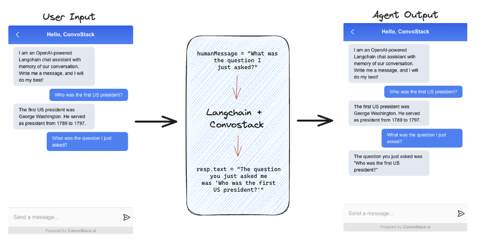

# Quickstart Guide

This tutorial gives you a walkthrough on how to quickly connect AI agents to the ConvoStack chatbot playground.

We will be using **Langchain** for creating the AI agents and **ConvoStack** for connecting these agents to a production-ready chatbot playground.


## Clone Quickstart Repo

To find all the examples below and an already-created repository with the necessary dependencies, simply clone the ConvoStack Quickstart repo and follow the ReadMe to immediately get started.

[Clone here!](https://github.com/ConvoStack/quickstart)

If instead you want to complete the walkthrough in your own existing Typescript project, follow the steps below:

## Installation

```bash
npm install convostack langchain@0.0.67 dotenv
```

After installing the following dependencies, create a `.ts` file. For this example, we will create on called `index.ts`

Because we are using OpenAI for our AI agents below, create a `.env` file and set:

```typescript
OPENAI_API_KEY = YOUR_API_KEY;
```

## Example 1: OpenAI Agent

In this example, we are connecting an OpenAI [LLM](https://js.langchain.com/docs/modules/models/llms/) to the chatbot playground.

```typescript
import * as dotenv from "dotenv";
// Configures the OpenAI API key
dotenv.config();

import { playground } from "convostack/playground";
import { IAgentContext, IAgentResponse } from "convostack/agent";
import { OpenAI } from "langchain/llms/openai";

playground({
  async reply(context: IAgentContext): Promise<IAgentResponse> {
    // `humanMessage` is the content of each message the user sends via the chatbot playground.
    let humanMessage = context.getHumanMessage().content;
    // `agent` is the OpenAI agent we want to use to respond to each `humanMessage`
    const agent = new OpenAI({ modelName: "gpt-3.5-turbo" });
    // `call` is a simple string-in, string-out method for interacting with the OpenAI agent.
    const resp = await model.call(humanMessage);
    // `resp` is the generated agent's response to the user's `humanMessage`
    return {
      content: resp,
      contentType: "markdown",
    };
  },
});
```

**See the code above in action via the following command:**

```bash
npx ts-node index.ts
```


## Example 2: LLM Chain

In this example, we are constructing an [LLMChain](https://js.langchain.com/docs/modules/chains/llm_chain) which takes a human message from the chatbot playground, formats it with a [PromptTemplate](https://js.langchain.com/docs/modules/prompts/prompt_templates/), and then passes the formatted response to an OpenAI agent.

The generated response of the agent will be streamed to the user via the chatbot playground.

```typescript
import * as dotenv from "dotenv";
// Configures the OpenAI API key
dotenv.config();

import { playground } from "convostack/playground";
import { IAgentContext, IAgentResponse } from "convostack/agent";
import {
  ChatPromptTemplate,
  HumanMessagePromptTemplate,
  SystemMessagePromptTemplate,
} from "langchain/prompts";
import { LLMChain } from "langchain/chains";
import { ChatOpenAI } from "langchain/chat_models/openai";

playground({
  async reply(context: IAgentContext): Promise<IAgentResponse> {
    // `humanMessage` is the content of each message the user sends via the chatbot playground.
    let humanMessage = context.getHumanMessage().content;
    // We can now construct an LLMChain from a ChatPromptTemplate and a chat model.
    const chat = new ChatOpenAI({
      streaming: true,
      temperature: 0,
      modelName: "gpt-3.5-turbo",
    });
    // Pre-prompt the agent to be a language translator
    const chatPrompt = ChatPromptTemplate.fromPromptMessages([
      SystemMessagePromptTemplate.fromTemplate(
        "You are a helpful assistant that translates {input_language} to {output_language}."
      ),
      HumanMessagePromptTemplate.fromTemplate("{text}"),
    ]);
    const chain = new LLMChain({
      prompt: chatPrompt,
      llm: chat,
    });

    // `resp` is the response of the OpenAI LLM chain translating `humanMessage` from English to French.
    const resp = await chain.call({
      input_language: "English",
      output_language: "French",
      text: humanMessage,
    });

    return {
      content: resp.text,
      contentType: "markdown",
    };
  },
});
```

**See the code above in action via the following command:**

```bash
npx ts-node index.ts
```


## Example 3: LLM Chain With History

In this example, we are connecting an OpenAI [LLM](https://js.langchain.com/docs/modules/models/llms/) that remembers the previous conversational back and forths directly using [Buffer Memory](https://js.langchain.com/docs/modules/memory/examples/buffer_memory) and `ConvoStackLangchainChatMessageHistory`.

The generated response of the agent will be streamed to the user via the chatbot playground.

```typescript
import * as dotenv from "dotenv";
// Configures the OpenAI API key
dotenv.config();

import { playground } from "convostack/playground";
import { IAgentContext, IAgentResponse } from "convostack/agent";
import { ConvoStackLangchainChatMessageHistory } from "convostack/langchain-memory";
import { ChatOpenAI } from "langchain/chat_models/openai";
import {
  SystemMessagePromptTemplate,
  HumanMessagePromptTemplate,
  ChatPromptTemplate,
  MessagesPlaceholder,
} from "langchain/prompts";
import { ConversationChain } from "langchain/chains";
import { BufferMemory } from "langchain/memory";

playground({
  async reply(
    context: IAgentContext,
    callbacks?: IAgentCallbacks
  ): Promise<IAgentResponse> {
    // `humanMessage` is the content of each message the user sends via the chatbot playground.
    let humanMessage = context.getHumanMessage().content;

    // Create a new OpenAI agent, with streaming
    const chat = new ChatOpenAI({
      modelName: "gpt-3.5-turbo",
      temperature: 0,
      streaming: true,
      callbacks: [
        {
          handleLLMNewToken(token: string) {
            // Stream tokens to ConvoStack
            callbacks?.onMessagePart({
              contentChunk: token,
            });
          },
        },
      ],
    });

    // Setup your prompts (note the placeholder for {history})
    const chatPrompt = ChatPromptTemplate.fromPromptMessages([
      SystemMessagePromptTemplate.fromTemplate(
        "The following is a friendly conversation between a human and an AI."
      ),
      new MessagesPlaceholder("history"),
      HumanMessagePromptTemplate.fromTemplate("{input}"),
    ]);

    // Setup the chain with a BufferMemory that pulls from the ConvoStack conversation history
    const chain = new ConversationChain({
      memory: new BufferMemory({
        // Use the ConvoStackLangchainChatMessageHistory class to prepare a Langchain-compatible version of the history
        chatHistory: new ConvoStackLangchainChatMessageHistory({
          // Pass the current conversation's message history for loading
          history: context.getHistory(),
        }),
        returnMessages: true,
        memoryKey: "history",
      }),
      prompt: chatPrompt,
      llm: chat,
    });

    // `resp` is the response of the OpenAI LLM chain to `humanMessage`, which was inputted on the ConvoStack playground.
    const resp = await chain.call({
      input: context.getHumanMessage().content,
    });

    // Send the final response to ConvoStack
    return {
      content: resp.response,
      contentType: "markdown",
    };
  },
});
```

**See the code above in action via the following command:**

```bash
npx ts-node index.ts
```


