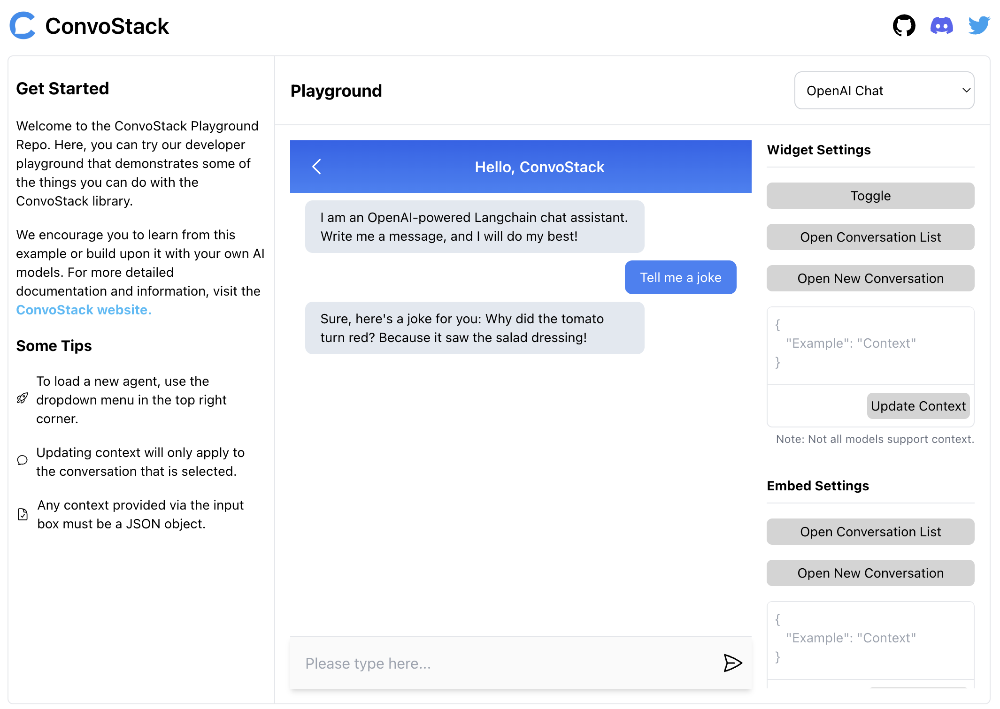

# Playground Repository

To check out the playground without setting it up yourself, click [here](https://playground.convostack.ai) for a live
demo!

By following this guide, you will end up with a runnable local version on your own machine. We estimate that you can go from `git clone` to running in a couple of minutes. If you don't want to read the details of each step, you can copy/paste the steps directly from the GitHub repo [README](https://github.com/ConvoStack/playground#quickstart).



## Requirements & Installation

To get started, clone the [ConvoStack playground monorepo](https://github.com/ConvoStack/playground):

```bash
# Clone the repo
git clone https://github.com/ConvoStack/playground convostack-playground

# Enter the project root directory
cd convostack-playground
```

From the root of the monorepo, let's install our dependencies:

```bash
# Install all dependencies
npm install
```

## Environment Setup

To load environment variables from a `.env` file in the `apps/backend` directory, the playground utilizes [dotenv](https://github.com/motdotla/dotenv).

You are not required to customize any parameters to run the playground, but you will need to copy the `.env.example`
file over to `.env` to get it up and running:

```bash
# Setup your backend .env using the example provided
# Optionally, edit the apps/backend/.env file to set your OpenAI and/or Pinecone API keys to try some of the more advanced demos
cd apps/backend
cp .env.example .env
```

## Database Migrations

ConvoStack requires a persistent storage engine that implements `convostack/models.IStorageEngine` in order to work.

Conveniently, ConvoStack comes with pre-built implementations of `IStorageEngine` so that you don't need to write any
boilerplate database code.

The default storage backend for the playground is SQLite, which means you don't need to run any databases yourself to
run the playground. However, we will still need to run migrations to setup the SQLite `.db` file:

```bash
# **Make sure that you're still in the apps/backend directory** #

# Run the SQLite migrations
npm run migrate-sqlite
```

## Running locally

Now that we have installed and set up our environment and database, we can locally run our playground application:

```bash
# Get back into the root of the project. If you were running migrations earlier, run:
cd ../..

# Start the full-stack demo from the root of the project
npm run dev

# 🚀 See the demo running now on http://localhost:5173/ (GraphQL server on http://localhost:3000/graphql)
```

And there we have it...the [ConvoStack playground](https://playground.convostack.ai) is running locally on your own
machine!

# Monorepo Overview

Up until now, we have setup and used an implementation of ConvoStack to power our playground.

To understand how this all magically works, we are going to dive into the key elements of the Convostack backend and
frontend frameworks which the playground monorepo implements.

### Backend Framework ([source](https://github.com/ConvoStack/playground/tree/master/apps/backend))

The ConvoStack backend framework offers several key features and options for easy development and setup:

- **[Database Support:](../backend/storage-engines)**
  - For development, ConvoStack supports SQLite for convenient setup and local testing.
  - For production, you have the flexibility to choose between Postgres and MySQL, ensuring compatibility with your
    preferred database system.
- **[Caching and Pub/Sub:](../backend/cache-pub-sub-redis)**
  - For development, ConvoStack provides in-memory caching and pub/sub capabilities, enabling efficient data
    management and real-time communication.
  - For production, ConvoStack supports Redis, a widely-used caching and message broker system.
- **[Multiple AI Agent Implementations:](../backend/llm-and-chat-agents)**
  - ConvoStack offers various "agent" implementations to suit different use cases (all four are built and running in
    the playground). These include:
    - "OpenAI Chat": an agent powered by OpenAI and Langchain that operates like the popular ChatGPT application.
      - Requires `OPENAI_API_KEY` to be set
    - "Echo Agent": a super-simple agent that showcases a minimalistic ConvoStack implementation with no API keys
      required.
    - "OpenAI Conversational QA": an agent powered by OpenAI and Langchain for question and answering given various
      sources.
      - Requires `OPENAI_API_KEY` to be set
    - "ConvoStack Docs Agent": a web crawler and chat QA chain based on Pinecone, OpenAI, and Langchain, which is
      production-ready for powering chat with your documentation or help center. Powers chat
      on [ConvoStack.ai](https://convostack.ai/) and this docs site!
      - Requires `OPENAI_API_KEY`, `PINECONE_API_KEY`, `PINECONE_ENVIRONMENT`, and `PINECONE_INDEX` to be set
      - Loading the documents requires running the following `npm run pinecone-load-convostack-docs` command in
        the `apps/backend` directory to crawl the ConvoStack docs website and load the embeddings into Pinecone.
        Make sure that you have created an index on Pinecone using dimension=1536 and the cosine distance function
        and updated your backend `.env` with the required env vars listed above.
- **[Deployment with Fly.io:](../production/deploy-with-fly-io)**
  - ConvoStack deploys seamlessly to Fly.io, providing free and easy hosting options. The included `fly.toml` file
    simplifies the deployment configuration process.
- **[Optional Docker Configuration:](../production/backend-dockerfile)**
  - ConvoStack offers an optional `docker-compose.yml` configuration for local development using Postgres, MySQL, and
    Redis. This facilitates a consistent development environment that closely mirrors the production setup.

By leveraging these features provided by the ConvoStack backend framework, you can efficiently develop and deploy
chatbot applications with ease. The framework's flexibility, database support, caching capabilities, agent
implementations, and hosting options make it a powerful choice for building conversational experiences.

### Frontend Framework ([source](https://github.com/ConvoStack/playground/tree/master/apps/frontend))

The ConvoStack frontend framework, powered by React, offers out-of-the-box AI chatbot components that connect to your
backend:

- **[Core React Components](../frontend/fe-components):**
  - The Widget: like the one running on [ConvoStack.ai](https://convostack.ai/) and this docs site! Customizable via
    the `CustomStyling` prop.
  - Embeddable Chat: can be embedded on any page of your website. Also customizable via the `CustomEmbedStyling` prop.
- **[useConvoStack Hook](../frontend/use-convostack-hook)**:
  - The framework provides an exported `useConvoStack` hook that offers functions enabling GraphQL API calls and
    component state management.
  - This hook simplifies interaction with the ConvoStack backend, facilitating seamless communication and efficient
    state management within the chatbot interface.
- **[User Data Integration:](../frontend/fe-components#props)**
  - By default, the ConvoStack frontend framework does not persist login data. Conversations will be cleared upon
    reloading the page.
  - If desired, you can customize the `ConvoStackWidget` configuration in `apps/frontend/src/main.tsx` using
    the `userData` prop to enable data persistence between sessions or even hardcode a demo user for development
    purposes.
- **Vite for Bundling:**
  - The ConvoStack frontend framework utilizes Vite as the bundler. Vite is a fast and efficient build tool that
    enhances development speed and optimizes the performance of the chatbot application.
- **Simplified Hosting:**
  - The build script of the ConvoStack frontend framework exports to the backend server, eliminating the need for
    separate static site hosting. This streamlined approach simplifies the deployment process, allowing for a single
    hosting solution for both the frontend and backend components of the ConvoStack application.

## Monorepo Project Structure

The playground monorepo is organized into two distinct applications in the `apps` workspace: `apps/backend`
and `apps/frontend`.

### Backend Folder

- The ConvoStack backend is initialized in the `apps/backend/src/server.ts` file
  - The agents are connected to the backend in this file
  - The Express server is defined here
- All ConvoStack agent implementations live in the `apps/backend/src/agents` directory
  - All agent logic lives in the agent files
  - There are no limitations on what frameworks and resources a ConvoStack agent can use, as long as it
    implements the `reply` method of `convostack/agent.IAgent`

### Frontend Folder

- The `ConvoStackWrapper` and `ConvoStackWidget` components are initialized in the `apps/frontend/src/App.tsx` file
  - The `graphqlUrl`, `websocket`, and `customStyling` prop values are defined here
- The `ConvoStackEmbed` components and `useConvoStack` hook are initialized in the `MobilePlayground.tsx`
  and `WebPlayground.tsx` components
  - The `useConvoStack` hook is also utilized in the `ContextInput.tsx` file

### Monorepo folder structure

```bash
./
  ├── apps/ # Monorepo apps workspace
  │   ├── backend/ # Typescript Express server
  │   │   ├── mysql-storage/... # Auto-generated MySQL Storage Backend migrations, schema, etc.
  │   │   ├── postgres-storage/... # Auto-generated Postgres Storage Backend migrations, schema, etc.
  │   │   ├── sqlite-storage/... # Auto-generated SQLite Storage Backend migrations, schema, etc.
  │   │   ├── scripts/... # Data loading and utility scripts
  │   │   ├── datasets/... # Demo data for the various agents
  │   │   ├── src/ # Express server source
  │   │   │   ├── agents/... # ConvoStack agents for playground demos
  │   │   │   ├── utils/... # Server and agent utils
  │   │   │   └── server.ts # Server entrypoint <--- ConvoStackBackendExpress is configured and initialized here
  │   │   ├── Dockerfile # Production deployment Dockerfile (compatible with Fly.io)
  │   │   ├── fly.toml # Fly.io deployment spec
  │   │   ├── package.json # Server dependencies and scripts
  │   │   └── tsconfig.json # Server TypeScript config
  │   └── frontend/ # TypeScript React Client
  │       ├── public/... # Public assets
  │       ├── src/ # React client source
  │       │   ├── api/... # Playground configuration API
  │       │   ├── components/... # Playground React components
  │       │   ├── types/... # Playground types
  │       │   ├── App.tsx # React app component
  │       │   ├── index.css # Playground client styles
  │       │   ├── main.tsx # Client entrypoint <--- ConvoStackWrapper is configured and initialized here
  │       ├── index.html # Client base index.html file
  │       ├── package.json # Client dependencies and scripts
  │       ├── postcss.config.js # PostCSS config
  │       ├── tailwind.config.js # Tailwind config
  │       ├── tsconfig.json # Client (browser) TypeScript config
  │       ├── tsconfig.node.json # Client (node) TypeScript config
  │       └── vite.config.ts # Vite config
  ├── docker-compose.yml # Optional Postgres, MySQL, and Redis docker-compose local configuration
  ├── package.json # Monorepo package.json configuration, dependencies, and global scripts
  └── turbo.json # Monorepo (Turbo) configuration and global scripts
```
