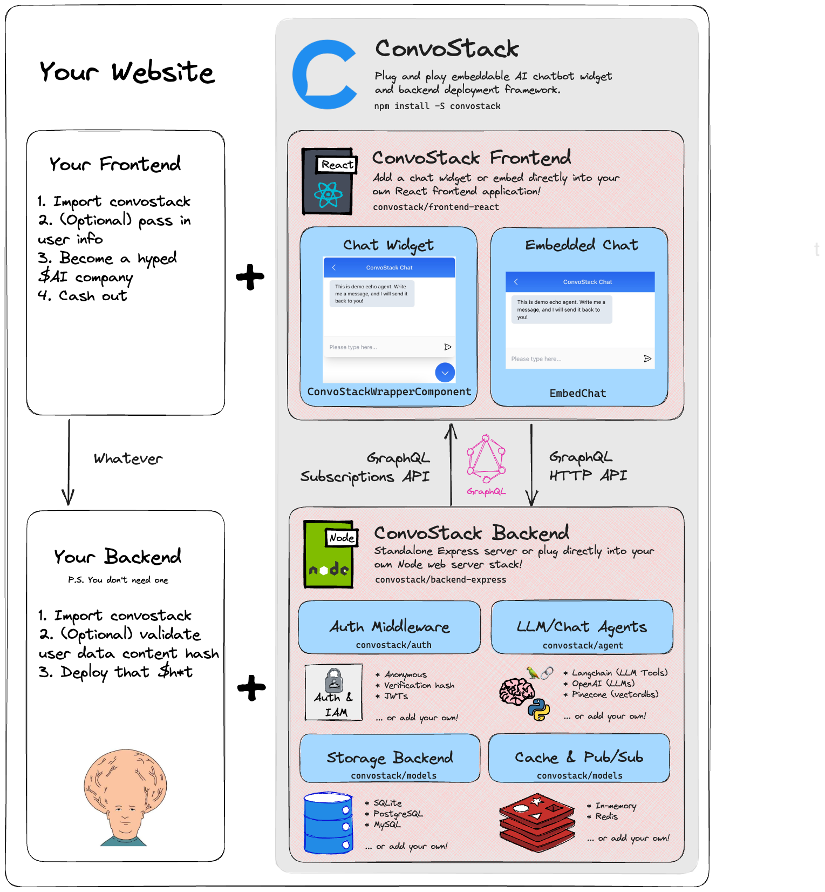

# Learn the Basics

## Why ConvoStack?

We created ConvoStack because we believe that every website should have the power to effortlessly integrate a cutting-edge AI chatbot completely for **free**. In as little as a few lines of code, you'll have a fully functional chatbot ready to engage with your users and enhance their experience.

Being **open-source**, ConvoStack enables you to customize, extend, and modify the codebase to meet your unique requirements. You're not limited by the constraints of a closed system or dependent on a third-party provider for updates and improvements. With ConvoStack, you can build upon a solid backend and frontend foundation while staying ahead of the curve in AI innovation.

Unlike other chat UI kits that charge expensive monthly fees based on message volume, ConvoStack follows the ethos of AI open-source and returns the power back to developers. It is a fully production-ready full-stack framework rather than just a chat-starter project.

This ensures that you have a comprehensive, free, and customizable solution that can be adjusted and adapted to suit your needs, supporting integrations with leading AI frameworks and software, such as LangChain, OpenAI, and Pinecone DB.

## Core Architecture

### Why LangChain?

LangChain is integrated with ConvoStack to provide AI agent capabilities. By leveraging LangChain, you can create and train your own AI models for natural language understanding and processing. This integration gives you the freedom to design chatbot conversations tailored to your specific use cases, without relying on external AI providers. You have full control over the AI models, enabling you to fine-tune them according to your requirements.

### Why Express.js?

ConvoStack utilizes Express.js as its backend framework. Express.js is a flexible and minimalistic web application framework for Node.js. It provides a robust set of features for building web servers and APIs, making it an ideal choice for handling backend logic in ConvoStack. With Express.js, you have the flexibility to integrate ConvoStack with various databases, authentication systems, and other third-party libraries as per your requirements.

### Why Redis?

ConvoStack leverages Redis for caching and a pub/sub system, ensuring seamless and predictable messaging between users and AI agents. Redis is an in-memory data structure store that allows for fast and efficient data storage and retrieval. It serves as a reliable and scalable solution for handling real-time communication and caching, enhancing the overall performance of your chatbot application.

### Why ReactJS?

ConvoStack is built using ReactJS, a popular JavaScript library for building user interfaces. ReactJS offers a component-based architecture, allowing for modular and reusable UI elements. By utilizing ReactJS, ConvoStack provides a seamless integration experience with your existing JavaScript website. You can easily incorporate the chatbot widget and embeddable components into your application, leveraging React's efficient rendering and state management capabilities.

### Core Architecture Diagram

